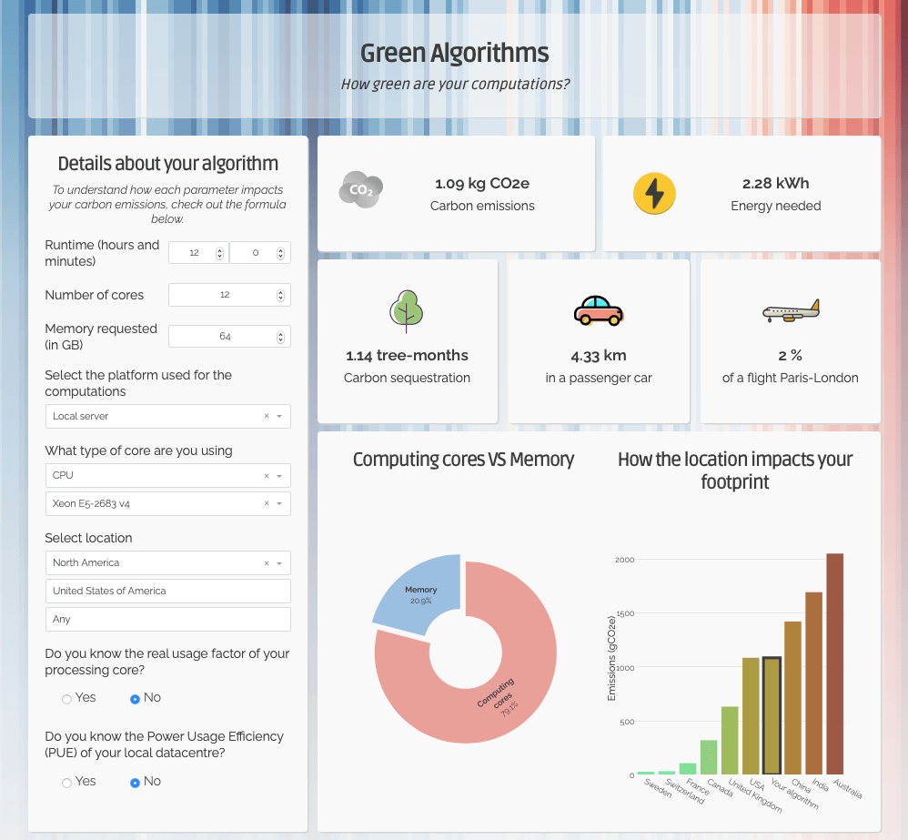

  
# Green Algorithms 

***How green are your computations?***

www.green-algorithms.org

---

## Methods and data

The methodology behind the Green Algorithms project is described in our pre-print:
_Coming soon_

All the data used for the calculator are in the `data` directory above. 

## Questions, issues, suggestions? Want to contribute?

Start by opening an issue here, and we will try to address it quickly:
https://github.com/GreenAlgorithms/green-algorithms-tool/issues

You can also contact us at: green.algorithms@gmail.com

## How to cite this work
> L. Lannelongue\*, J. Grealey\* and M. Inouye, 
“Green Algorithms: A simple method and tool for quantifying the carbon emissions of computation” (in preparation), 
www.green-algorithms.org (2020)

_\* Contributed equally to this work_

## Credits 

- the app was designed using [Plotly Dash](https://plot.ly/dash/)
- The background image is realised by [Ed Hawkins](https://showyourstripes.info) from the University of Reading
- The icons used are under [CC Attribution licence](https://creativecommons.org/licenses/by/4.0/) 
and have been designed by 
[Laura Reen](https://icon-icons.com/icon/weather-co2-pollution/90772),
[Jeremiah](https://icon-icons.com/icon/preferences-system-power-energy/103835),
[Sergei Kokota](https://icon-icons.com/icon/tree-greenery-nature/53329),
[Baianat](https://icon-icons.com/icon/car/61086) and
[RoundIcons](https://icon-icons.com/icon/plane-airplane/89770)

## Licence

This work is licensed under a
[Creative Commons Attribution 4.0 International License][cc-by].

[![CC BY 4.0][cc-by-shield]][cc-by]

[![CC BY 4.0][cc-by-image]][cc-by]

[cc-by]: http://creativecommons.org/licenses/by/4.0/
[cc-by-image]: https://i.creativecommons.org/l/by/4.0/88x31.png
[cc-by-shield]: https://img.shields.io/badge/License-CC%20BY%204.0-lightgrey.svg
